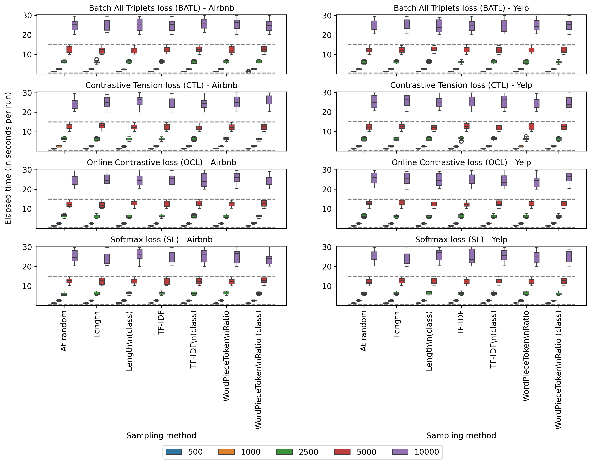

# README

## Example of Seaborn + Matplotlib - Multiple subplots - Data in files
| # | Field Name               | Data                             |
|---|--------------------------|----------------------------------|
| 1 | Arxiv URL                | [arXiv file](https://arxiv.org/abs/2403.15455) [publication](https://link.springer.com/chapter/10.1007/978-3-031-78495-8_28)                       |
| 2 | Visualisation Image      | |
| 3 | Visualisation Caption    | Results for Airbnb (left) and Yelp (right). The dashed lines correspond to the maximum and minimum Macro F1-Score values using SBERT without update. The numbers in the legend correspond to the sample sizes.  |
| 4 | Plotting Data            | [data.zip](./data.zip)     |
| 5 | Code                     | [code.ipynb](./code.ipynb) (attached in this folder)         |
| 6 | Command                  | `jupyter nbconvert --to script code.ipynb && python code.py`           |
| 7 | Natural Language Request | For the given data, show a plot with multiple subplots, having two columns, one per dataset, and one row per loss function. Plot the Macro F1 values, where each column in the subplot corresponds to a sampling method, and within the sampling method, each color corresponds to a sample size.|

The code in this repo regards the paper **"GARCIA, Cristiano Mesquita et al. Improving sampling methods for fine-tuning SentenceBERT in text streams. In: International Conference on Pattern Recognition. Springer, Cham, 2025. p. 445-459."**, but it DOES NOT contain the actual values published in the paper. 
However, it contains values for visualization purposes only.

If you use this code, please consider citing the paper:

```
@inproceedings{garcia2025improving,
  title={Improving sampling methods for fine-tuning SentenceBERT in text streams},
  author={Garcia, Cristiano Mesquita and Koerich, Alessandro Lameiras and Britto Jr, Alceu de Souza and Barddal, Jean Paul},
  booktitle={International Conference on Pattern Recognition},
  pages={445--459},
  year={2025},
  organization={Springer}
}
```
